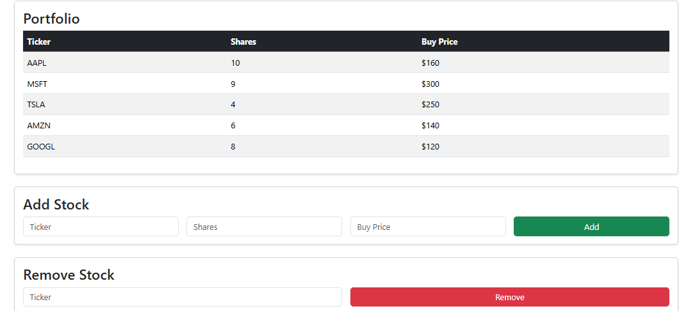
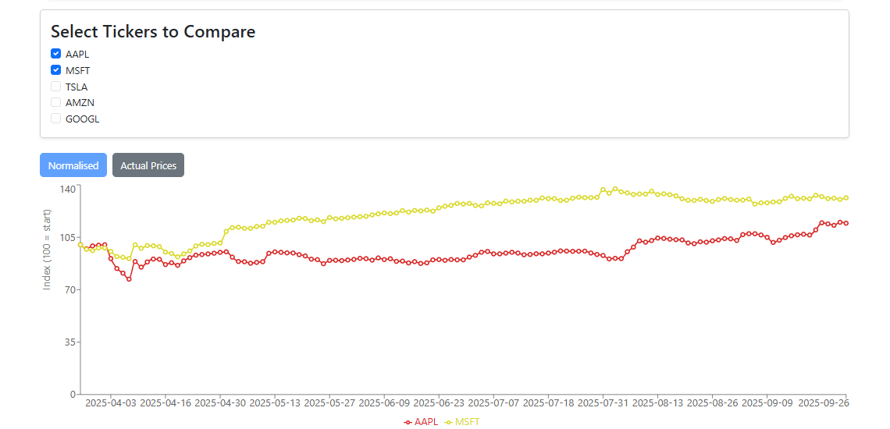
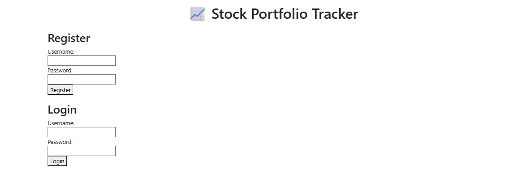

# Stock Portfolio Tracker

A dynamic web application to manage and track your stock portfolio with live data, news, and interactive charts. Built with React.js and Flask, it offers an intuitive interface for users to monitor and compare stocks in real-time.

## Features

### User Registration & Login
- Secure user authentication system
- Users can create accounts, log in, and manage their portfolio
- Implemented using **Register** and **Login** React components

### Portfolio Management
- Add or remove stocks from your portfolio
- View portfolio value and individual stock details
- Real-time updates of stock holdings

### Historical Stock Comparison
- Compare multiple stocks on a single chart
- Automatic refresh every 20 seconds
- Implemented via the **CompareChart** component
- Visualizes historical stock performance normalized to start at 100

### Live Stock Data & News
- Fetches stock prices from Yahoo Finance API
- Displays latest stock-related news via NewsAPI

### Interactive & Responsive Frontend
- Responsive design using Bootstrap
- Dynamic tables and charts for clear data visualization

## Tech Stack
- **Frontend:** React.js, Bootstrap  
- **Backend:** Flask  
- **Data Sources:** Yahoo Finance API, NewsAPI  
- **Version Control:** Git & GitHub  

## Screenshots 
- **Portfolio Table:** 
- **Compare Chart:** 
- **Register/Login:** 

## How to Run
1. Clone repo: git clone 'https://github.com/temi190/stock-portfolio-tracker.git'
2. Install backend dependencies: `pip install -r requirements.txt`
3. Install frontend dependencies: `cd frontend`,  `npm install`
4. Run the backend server, Flask app: `python backend/app.py`
5. Run the frontend: `npm start`
6. Access the app: Open your browser and go to http://localhost:3000
